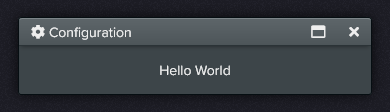
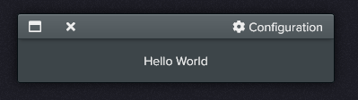
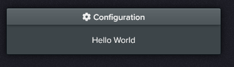

# Dialog

Floating container, has a header bar and a content area where other elements can be placed.

### Sample Code

```html
<zl-dialog class="x-draggable">
    <div class="header">
        <b><i class="fa fa-cog"></i>Configuration</b>

        <span>
            <i data-action="restore" class="far fa-window-restore"></i>
            <i data-action="maximize" class="far fa-window-maximize"></i>
            <i data-action="hide" class="fas fa-times"></i>
        </span>
    </div>

    <div class="content p-4 text-center" style="width: 320px;">
        Hello World
    </div>
</zl-dialog>
```

### Preview



&nbsp;<br/>
## CSS Class Modifiers

|Class						|Description|
|-							|-|
|.x-draggable				|Allows the dialog to be dragged around by its header.|
|.x-buttons-left			|The header buttons are shown on the left side.|
|.x-buttons-hidden			|Header buttons are not shown at all.|
|.x-title-right				|The dialog title text is aligned to the right.|
|.x-title-center			|The dialog title text is centered.|
|.x-title-bold				|Title text style is bold.|

&nbsp;<br/>
## Actions

|Name						|Description|
|-							|-|
|hide()						|Hides the dialog.|
|show()						|Shows the dialog.|
|maximize()					|Maximizes the dialog to cover the entire screen.|
|restore()					|Restores the dialog to its original size.|

&nbsp;<br/>
## Other Previews

#### .x-title-right .x-buttons-left


#### .x-title-center .x-buttons-hidden

