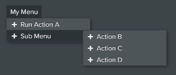

# Dropdown Menu [CSS]

Defines a dropdown menu that shows when the pointer is over the dropdown element, note that since this is a CSS element, any `data-action` will be executed in the element's `root`.

### Sample Code
```html
<div class="xui-dropdown">
    <b>My Menu</b>
    <ul>
        <li><b data-action="actionA"><i class="fas fa-plus"></i> Run Action A</b></li>
        <li class="sub-menu">
            <b><i class="fas fa-plus"></i> Sub Menu</b>
            <ul>
                <li><b data-action="actionB"><i class="fas fa-plus"></i> Action B</b></li>
                <li><b data-action="actionC"><i class="fas fa-plus"></i> Action C</b></li>
                <li><b data-action="actionD"><i class="fas fa-plus"></i> Action D</b></li>
            </ul>
        </li>
    </ul>
</div>
```

### Preview


&nbsp;<br/>
## Class Modifiers

|Class						|Description|
|-							|-|
|.x-compact					|Reduces the padding and size of dropdown items to make a more compact look.|
|.x-no-icons				|Hides all icons from the dropdown menu. That is, elements matching `li > b > i`.

&nbsp;<br/>
## Other Previews

#### .x-compact


#### .x-no-icons .x-compact

