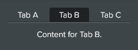

# Tabs

A container with multiple panels, each of which can have one or more elements. A second element for the tab-content is required, this container is referenced by using the `data-container` attribute.

The tab-content container should have one or more div elements each with a `data-name` attribute matching the same name defined in the buttons of the zl-tabs element.

### Sample Code

```html
<zl-tabs data-container="div.tab-container" data-default="tab_b">
    <a data-name="tab_a">Tab A</a>
    <a data-name="tab_b">Tab B</a>
    <a data-name="tab_c">Tab C</a>
</zl-tabs>

<div class="tab-container">
    <div data-name="tab_a">
        Content for Tab A.
    </div>

    <div data-name="tab_b">
        Content for Tab B.
    </div>
</div>
```

### Preview



&nbsp;<br/>
## Attributes

|Attribute Name|Required|Description
|-|-|-
|data-container|`false`|CSS selector of a single element that is the tab-content container. If none specified the next sibling is considered the tab-content container.
|data-default|`false`|Name of the tab to select by default. If none specified no tab will be selected.
